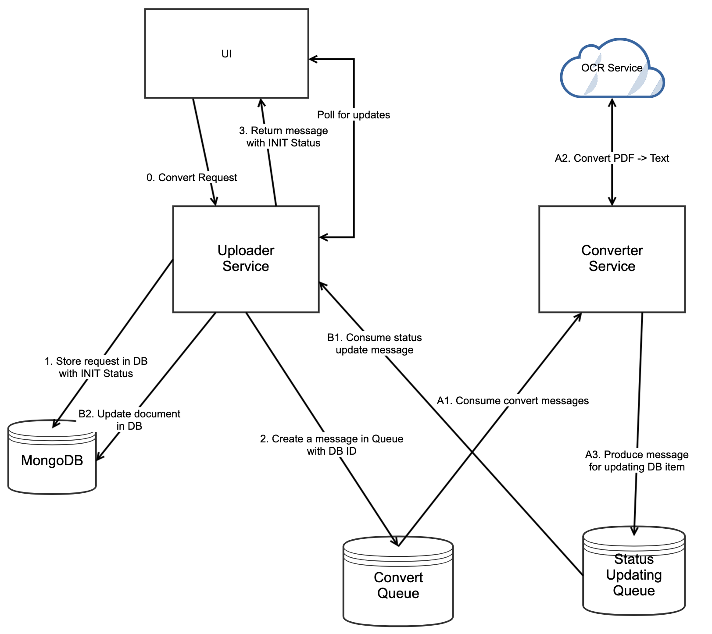

# Introduction

PDF Converter allows users to convert PDF files into plain text files. Users can upload any PDF file to system,
and in return retrieve them as plain text files. Files are converted asyncronously which means users can continue
using the website while their uploaded file is being processed.

The system contains following parts: 

* **RabbitMQ**: For passing messages to be processed asyncronously.
* **MongoDB**: Database to store information about file upload tasks.
* **Uploader Service**: Customer facing service.
* **Converter Service**: Service responsible for file conversion.

## System Architecture

Developed system contains 2 services. I separated converter and uploader services in order 
to apply changes easily and for a scalable solution. This way we can easily scale up or down 
a service without touching the other one.

I also implemented them in a way that they don't directly talk to each other. All communication
between them is established over message queue.

[Uploader Service](documentation/uploader_service.md) has endpoints exposed to outside to upload files and get their statuses. 
This service is also responsible from handling DB operations 
 
[Converter Service](documentation/converter_service.md) Listens RabbitMQ for conversion requests and calls a 3rd party service to convert pdf files to plain text 